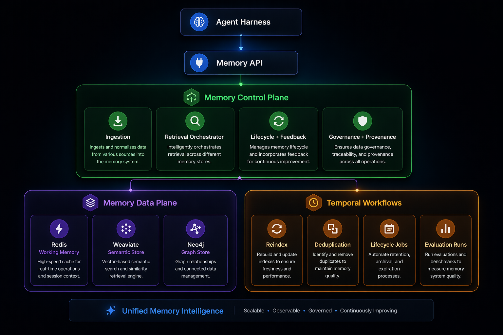
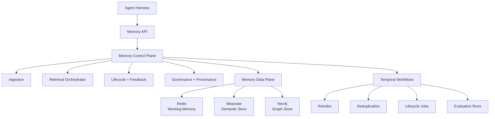

# Chronogram


`Chronogram` is a memory operating system for agents.

It gives an agent stack one control plane for memory instead of forcing every agent to talk to `Redis`, `Weaviate`, `Neo4j`, and `Temporal` directly.

## In One Sentence

Chronogram ingests raw interactions, turns them into structured memory, stores them across multiple substrates, retrieves the right context later, and runs background maintenance workflows to keep that memory useful over time.

## What This Is

Chronogram is:

- a front-door memory API for agent applications
- a retrieval and routing layer across multiple memory backends
- a lifecycle manager for reinforcement, feedback, reindexing, and compaction
- a local-first developer stack you can run on one machine

Chronogram is not:

- just a vector database
- just a graph store
- just a RAG wrapper
- a finished multi-tenant SaaS platform

## What Problems It Solves

Without a memory control plane, agent systems usually end up with:

- fragmented memory spread across incompatible tools
- no clear distinction between working, episodic, semantic, and procedural memory
- weak lifecycle behavior after initial ingestion
- poor observability into what was stored, recalled, or promoted

Chronogram addresses that by:

- ingesting memories through one API
- routing data to the most useful substrate
- combining lexical, semantic, graph, and recency signals during recall
- promoting durable facts, episodes, and procedures from high-pressure conversations
- exposing health, workflow, and module metrics endpoints

## Architecture



Reference flow, in text form:



## Current Scope

The current repo is a working `TypeScript` implementation with:

- real ingest into `Redis`, `Weaviate`, and `Neo4j`
- hybrid recall using lexical, semantic, graph, and working-memory signals
- feedback-driven salience updates
- adaptive conversation compaction into episodic, semantic, and procedural memory
- Temporal-backed worker execution with local fallback behavior
- health, workflow, and Prometheus metrics endpoints
- Docker, CI, container images, and Kubernetes reference manifests
- staged deployment workflow and Prometheus Operator reference alerting

`FastAPI` and `FastMCP` appear in documentation as future facade options, not as the runtime shipped by this repository today.

## Monorepo Layout

- `apps/memory-api`: front-door HTTP API
- `apps/worker`: workflow and background execution service
- `packages/core`: routing, retrieval, lifecycle, workflows, and adapters
- `packages/config`: environment parsing and path resolution
- `packages/schemas`: shared request and response contracts
- `infra/docker`: local observability and infrastructure config
- `deploy/k8s`: reference app-layer Kubernetes manifests
- `docs/`: architecture, setup, deployment, and roadmap docs

## Quick Start

If you want the fastest path, use the bootstrap command:

```bash
node scripts/bootstrap.mjs init
```

### Prerequisites

- `Node.js` 22+
- `pnpm`
- `Docker` with `docker compose`

### Install

```bash
pnpm install
```

### Configure

```bash
cp .env.example .env
```

The default local ports are:

- memory API: `4000`
- worker: `4010`
- Redis: `6380`
- Weaviate: `8080`
- Neo4j HTTP: `7474`
- Neo4j Bolt: `7687`
- Temporal: `7233`
- Grafana: `3001`
- Prometheus: `9090`
- Alertmanager: `9093`

Local source runs keep the default file-backed memory state in `./data`. Containerized app deployments now default to Redis-backed shared state through `MEMORY_STATE_BACKEND=redis`.

### Start Infrastructure

```bash
docker compose up -d
docker compose ps
```

Note: Docker Redis is intentionally mapped to `localhost:6380` to avoid collisions with host Redis instances on `6379`.

### Start Services

Run these in separate terminals:

```bash
pnpm --filter @chronogram/memory-api dev
pnpm --filter @chronogram/worker dev
```

### Verify Health

```bash
curl http://127.0.0.1:4000/health
curl http://127.0.0.1:4010/health
```

## Onboarding And Bootstrap

Chronogram now ships with two onboarding paths:

- a zero-install bootstrap CLI for first-time setup
- a local onboarding UI for guided setup and harness connection

### Zero-install bootstrap CLI

This works before `pnpm install` because it only requires `node`.

```bash
node scripts/bootstrap.mjs init
node scripts/bootstrap.mjs doctor
node scripts/bootstrap.mjs connect
node scripts/bootstrap.mjs down
```

What `init` does:

- creates `.env` from `.env.example` when needed
- generates `CHRONOGRAM_API_KEY` if it is blank
- runs `pnpm install --frozen-lockfile`
- starts infrastructure with `docker compose up -d`
- starts the app profile with `docker compose --profile app up -d --build`
- returns a health report at the end

### Guided onboarding UI

After dependencies are installed, launch the local onboarding UI:

```bash
pnpm chronogram:ui
```

Then open:

```bash
open http://127.0.0.1:4020
```

The UI provides:

- prerequisite checks for `node`, `pnpm`, and `docker`
- live service health for Chronogram and key dependencies
- a one-click full bootstrap action
- a stop-stack action
- generated harness connection snippets

### Harness bundle output

Both onboarding paths can generate a reusable harness bundle in:

- [`generated/harness/chronogram-harness-config.json`](generated/harness/chronogram-harness-config.json)
- [`generated/harness/chronogram-harness-config.md`](generated/harness/chronogram-harness-config.md)

This bundle is HTTP-first and includes:

- environment exports
- a JSON manifest for the memory API endpoints
- a Node fetch example
- a curl smoke test

Chronogram does not yet ship a native MCP or FastMCP facade in this repository, so harness integration is currently done over HTTP.

## Deployment Automation

Container image publishing happens from Git tags through:

- `.github/workflows/release-images.yml`

Reference Kubernetes deployment paths now include:

- `.github/workflows/deploy-reference.yml` for targeted environment deploys
- `.github/workflows/promote-release.yml` for staging-to-production promotion of a released image tag

The promotion flow deploys the requested image tag to `staging` first and only proceeds to `production` after staging succeeds. Use GitHub Environment protection rules on `production` if you want an approval gate before the second step runs.

## Production Validation

The repo now includes a production-readiness CLI in [`scripts/production-readiness.mjs`](scripts/production-readiness.mjs).

Useful commands:

```bash
pnpm chronogram:preflight -- --env-file .env.production.example
pnpm chronogram:smoke
pnpm chronogram:load -- --requests 60 --concurrency 6
```

The full rollout checklist lives in [`docs/deployment/production-readiness.md`](docs/deployment/production-readiness.md).

## Monitoring And Alerting

Chronogram exposes Prometheus metrics from both the API and worker services and now includes Prometheus Operator reference manifests for:

- `ServiceMonitor`
- `PodMonitor`
- `PrometheusRule`
- `AlertmanagerConfig`

The in-cluster alert rules track target availability, workflow failures, workflow backlog, and ingest/recall latency. Adapt the example receiver endpoints before applying the alert manager config in a real environment.

## How To Use Chronogram

### 1. Ingest memory

```bash
curl -X POST http://127.0.0.1:4000/v1/memories/ingest \
  -H 'content-type: application/json' \
  -d '{
    "scope": "workspace",
    "source": "readme-example",
    "tags": ["memory-os", "demo"],
    "content": "The Retrieval Orchestrator uses Redis for working memory, Weaviate for semantic search, and Neo4j for graph reasoning."
  }'
```

What happens:

- Chronogram creates memory artifacts and chunks
- working-memory recency is updated in `Redis`
- semantic chunks are mirrored into `Weaviate`
- entities and relationships are written into `Neo4j`
- maintenance workflows can be scheduled automatically

### 2. Recall relevant context

```bash
curl -X POST http://127.0.0.1:4000/v1/memories/recall \
  -H 'content-type: application/json' \
  -d '{
    "query": "What does the Retrieval Orchestrator use for working memory and graph reasoning?",
    "scope": "workspace",
    "includeDiagnostics": true
  }'
```

Expected behavior:

- Chronogram fuses results from multiple stores
- results are reranked into one response payload
- diagnostics show which memory systems contributed

### 3. Reinforce or demote memory with feedback

```bash
curl -X POST http://127.0.0.1:4000/v1/memories/feedback \
  -H 'content-type: application/json' \
  -d '{
    "artifactId": "<artifact-id>",
    "useful": true
  }'
```

### 4. Compact a conversation window into durable memory

```bash
curl -X POST http://127.0.0.1:4000/v1/memories/compact \
  -H 'content-type: application/json' \
  -d '{
    "scope": "workspace",
    "occupancyRatio": 0.74,
    "sessionId": "demo-session",
    "messages": [
      { "role": "user", "content": "Redis runs on port 6380 locally and should stay that way." },
      { "role": "assistant", "content": "First inspect docker compose health, then restart the worker, then verify recall." },
      { "role": "user", "content": "There is still a blocker: follow up on auth rollout after deployment." }
    ]
  }'
```

Expected behavior:

- Chronogram detects context pressure
- it derives episodic, semantic, and procedural candidates
- high-confidence candidates are promoted into durable memory modules
- the response explains whether compaction triggered and what was promoted

### 5. Run maintenance workflows

```bash
curl -X POST http://127.0.0.1:4010/workflows/reindex
```

You can also inspect workflow activity:

```bash
curl http://127.0.0.1:4000/v1/workflows/runs
curl http://127.0.0.1:4010/workflows/definitions
```

### 6. Inspect observability

```bash
curl http://127.0.0.1:4000/v1/metrics/modules
curl http://127.0.0.1:4000/metrics
curl http://127.0.0.1:4010/metrics
```

Optional local dashboards:

```bash
open http://127.0.0.1:3001
open http://127.0.0.1:9090
open http://127.0.0.1:9093
```

## API Surface

### Memory API

- `GET /health`
- `GET /v1/memories`
- `POST /v1/memories/ingest`
- `POST /v1/memories/recall`
- `POST /v1/memories/feedback`
- `POST /v1/memories/compact`
- `GET /v1/workflows/runs`
- `GET /v1/metrics/modules`
- `GET /metrics`

### Worker API

- `GET /health`
- `POST /workflows/reindex`
- `GET /workflows/definitions`
- `GET /workflows/runs`
- `GET /metrics/modules`
- `GET /metrics`
- `POST /workflows/execute`

## Optional Graphiti Mode

To use the Python Graphiti bridge:

- set `TEMPORAL_GRAPH_BACKEND=graphiti-python`
- install `graphiti-core` into the runtime referenced by `GRAPHITI_PYTHON_BIN`
- ensure that runtime has the LLM and embedding credentials it needs
- keep `GRAPHITI_GROUP_ID` set so episodic memory stays namespaced correctly

Validated local defaults:

- `EXTRACTION_MODEL=qwen2.5:14b`
- `EMBEDDING_MODEL=nomic-embed-text`
- `OLLAMA_HOST=http://127.0.0.1:11434`

Low-resource fallback:

- `EXTRACTION_MODEL=qwen2.5:7b`
- `EMBEDDING_MODEL=nomic-embed-text`

## Readiness For Distribution

This repo is not at the same readiness level for every kind of distribution. The checklist below is the blunt version.

### 1. Open Source Release Readiness

Status: `Yes, with caveats`

What is already in place:

- working code paths for ingest, recall, feedback, compaction, and workflows
- `pnpm typecheck`, `pnpm build`, and `pnpm test` pass
- container files for `memory-api` and `worker`
- CI validation on pull requests and `main`
- tagged image publishing workflow to `GHCR`
- environment templates and deployment reference manifests
- community docs and repository hygiene files

What to keep clear in the README and release notes:

- this is a local-first and reference-distribution project today
- the Kubernetes manifests are app-layer reference manifests, not a full production stack
- distributed production operation still requires additional infrastructure and hardening

### 2. Staging Readiness

Status: `Partially`

Good enough for a controlled staging environment if you provide:

- managed or separately deployed `Redis`, `Weaviate`, `Neo4j`, `Temporal`, and `PostgreSQL`
- real secrets instead of placeholder values
- ingress and TLS
- smoke tests that hit the full stack after deploy

Main staging gaps still present in the repo:

- the Kubernetes folder does not deploy the stateful dependencies
- no end-to-end staging deploy pipeline is present yet
- harness integration is HTTP-first today and does not yet include a native MCP facade

### 3. Production Readiness

Status: `Not yet`

Main blockers:

- no complete production deployment package for the full dependency graph
- auth is still API-key level, not a stronger identity and authorization model
- secret management, backups, disaster recovery, and network isolation are not fully implemented in-repo
- no documented rollback-tested production CD path

Production should only be claimed once these are done:

- finalize a full deployment shape for all stateful services
- put real auth, TLS, secret management, and backups in place
- add post-deploy smoke checks and rollback procedures

## Deployment Assets

Chronogram already includes:

- app container files:
  - [`apps/memory-api/Dockerfile`](apps/memory-api/Dockerfile)
  - [`apps/worker/Dockerfile`](apps/worker/Dockerfile)
- CI:
  - [`.github/workflows/ci.yml`](.github/workflows/ci.yml)
  - [`.github/workflows/release-images.yml`](.github/workflows/release-images.yml)
- env templates:
  - [`.env.example`](.env.example)
  - [`.env.production.example`](.env.production.example)
- Kubernetes reference manifests:
  - [`deploy/k8s/configmap.yaml`](deploy/k8s/configmap.yaml)
  - [`deploy/k8s/secret.example.yaml`](deploy/k8s/secret.example.yaml)
  - [`deploy/k8s/platform-secrets.example.yaml`](deploy/k8s/platform-secrets.example.yaml)
  - [`deploy/k8s/external-secret.example.yaml`](deploy/k8s/external-secret.example.yaml)
  - [`deploy/k8s/networkpolicy.yaml`](deploy/k8s/networkpolicy.yaml)
  - [`deploy/k8s/poddisruptionbudgets.yaml`](deploy/k8s/poddisruptionbudgets.yaml)
  - [`deploy/k8s/hpa.yaml`](deploy/k8s/hpa.yaml)
  - [`deploy/k8s/servicemonitor.example.yaml`](deploy/k8s/servicemonitor.example.yaml)
  - [`deploy/k8s/podmonitor.example.yaml`](deploy/k8s/podmonitor.example.yaml)
  - [`deploy/k8s/ingress.example.yaml`](deploy/k8s/ingress.example.yaml)
  - [`deploy/k8s/memory-api-deployment.yaml`](deploy/k8s/memory-api-deployment.yaml)
  - [`deploy/k8s/worker-deployment.yaml`](deploy/k8s/worker-deployment.yaml)
  - [`deploy/k8s/platform`](deploy/k8s/platform)
- deploy workflow:
  - [`.github/workflows/deploy-reference.yml`](.github/workflows/deploy-reference.yml)
- restore runbook:
  - [`docs/deployment/backup-and-restore.md`](docs/deployment/backup-and-restore.md)

## Launch Paths

### Local source launch

```bash
pnpm install
docker compose up -d
pnpm --filter @chronogram/memory-api dev
pnpm --filter @chronogram/worker dev
```

### Build container images locally

```bash
docker build -f apps/memory-api/Dockerfile -t chronogram/memory-api:local .
docker build -f apps/worker/Dockerfile -t chronogram/worker:local .
```

### Run with the compose app profile

```bash
cp .env.production.example .env
docker compose --profile app up -d --build
```

### Apply the Kubernetes app-layer reference

```bash
kubectl apply -f deploy/k8s/namespace.yaml
kubectl apply -f deploy/k8s/configmap.yaml
kubectl apply -f deploy/k8s/secret.example.yaml
kubectl apply -f deploy/k8s/memory-api-deployment.yaml
kubectl apply -f deploy/k8s/worker-deployment.yaml
```

Important: this Kubernetes reference does not deploy `Redis`, `Weaviate`, `Neo4j`, `Temporal`, or `PostgreSQL`. Those must be provided separately.

### Apply the full self-hosted Kubernetes reference

```bash
kubectl apply -k deploy/k8s/platform
kubectl apply -f deploy/k8s/networkpolicy.yaml
kubectl apply -f deploy/k8s/poddisruptionbudgets.yaml
kubectl apply -f deploy/k8s/hpa.yaml
kubectl apply -f deploy/k8s/configmap.yaml
kubectl apply -f deploy/k8s/secret.example.yaml
kubectl apply -f deploy/k8s/memory-api-deployment.yaml
kubectl apply -f deploy/k8s/worker-deployment.yaml
```

The full reference stack includes Redis, Weaviate, Neo4j, Temporal, and PostgreSQL, plus network policies and disruption budgets, but it is still a reference deployment that should be hardened for storage classes, backups, and environment-specific resource sizing before production use.

If you use the Prometheus Operator, the repo also includes reference `ServiceMonitor` and `PodMonitor` manifests for authenticated app metrics scraping.

## Security And Hardening

Already present:

- request size limits through `MAX_REQUEST_BYTES`
- graceful shutdown hooks for `SIGINT` and `SIGTERM`
- optional auth modes for non-health routes:
  `api-key`, `jwt`, `hybrid`, and `none`
- JWT/OIDC bearer validation with issuer, audience, JWKS, and required-scope support
- Redis-backed shared state for containerized deployments
- file-backed local state for source-run development

Still required before internet-facing production use:

- secret management instead of inline secrets or example manifests
- TLS ingress
- backup and restore procedures for every stateful dependency

## Documentation

- [Setup and Usage](docs/setup/setup-and-usage.md)
- [Backup and Restore](docs/deployment/backup-and-restore.md)
- [Distributed Deployment Guide](docs/deployment/distributed-open-source-deployment.md)
- [Kubernetes Reference](deploy/k8s/README.md)
- [Source Alignment Notes](docs/reference/source-alignment.md)
- [Execution Roadmap](docs/roadmap/mvp-roadmap.md)
- [System Overview](docs/architecture/system-overview.md)
- [ADR 001: Architecture Boundaries](docs/adr/001-control-plane-boundaries.md)

## Summary

If you want the shortest honest description:

- use Chronogram today for local development, demos, evaluation, and reference open-source distribution
- use it in staging only if you supply the missing infrastructure and accept the current shared-state caveat
- do not claim full production readiness yet
